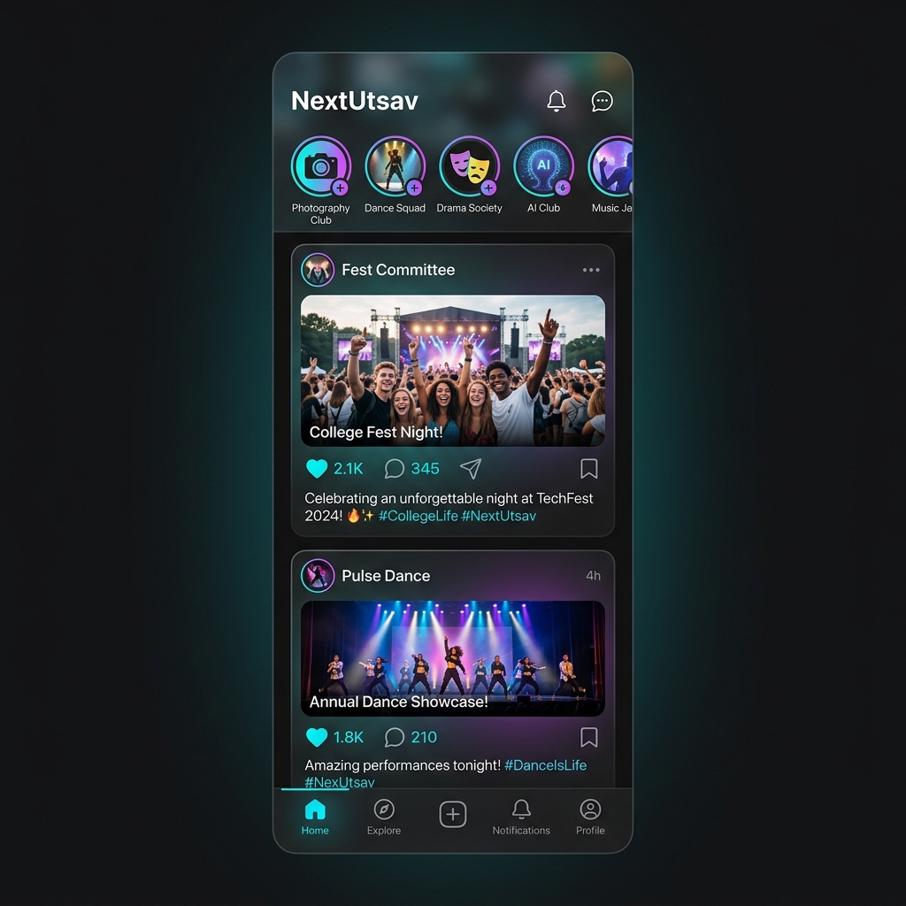
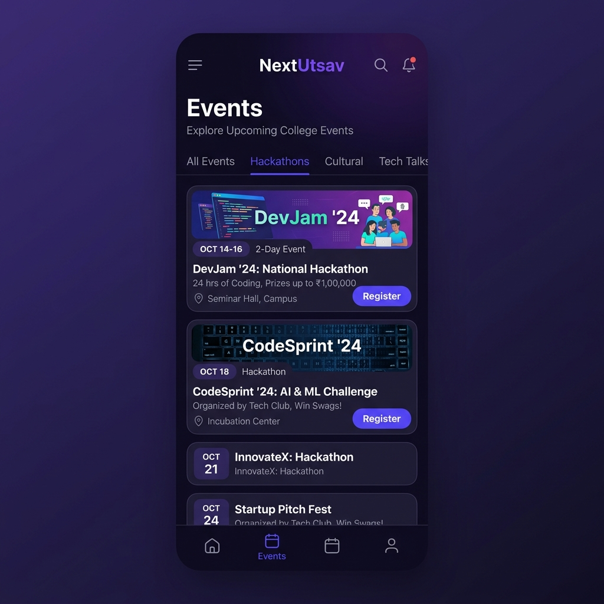

# NextUtsav — College Extracurricular Activity Platform

A production-ready Flutter mobile application for discovering, managing, and participating in college clubs, events, and extracurricular activities.

## 📸 Screenshots
<div style="display: flex; gap: 10px;">
  
  
</div>

## ✨ Features

### 🔐 Onboarding
- **Splash Screen** — Animated logo with gradient background
- **College Picker** — Search and select your institution
- **Login** — Mock authentication with college credentials
- **Interest Tags** — Select 3+ interests for personalized recommendations
- **Suggested Clubs** — Follow clubs based on your interests

### 🏠 Home Feed
- Horizontal stories bar with club avatars (Instagram-style)
- Vertical post feed with image posts
- Animated like button with scale bounce
- Expandable captions with "read more"
- Pull-to-refresh and infinite scroll
- Event promotion banner on event posts

### 🔍 Discover
- Full-text search across clubs and events
- Category filter chips (Technical, Cultural, Sports, Music, etc.)
- Popular clubs horizontal carousel
- Upcoming events vertical list

### 📅 Events
- Toggle between List View and Calendar View
- Filter: All, Registered, Upcoming, Past
- Event cards with poster, date badge, venue, and registration CTA
- Calendar view with event dots (table_calendar)

### 🎫 Event Details
- Hero parallax poster image
- Date, time, venue info with map icon
- Club info row with follow button
- Expandable description
- Tags row
- Volunteer opportunities section
- Register button with confetti animation 🎉
- QR code ticket after registration

### 🏛️ Club Details
- Sticky cover photo header with club avatar
- Follow/Unfollow with snackbar confirmation
- Animated member and follower counters
- Tabbed view: Posts | Events | About
- Achievements list and core team members

### 🏆 Activity
- XP points with level and progress bar
- Badge collection (earned and locked)
- Certificates list with download option
- Event attendance history

### 👤 Profile
- Avatar, name, college info
- Stats: Events Attended, Clubs Followed, XP Points
- Followed clubs horizontal scroll
- Quick links: Applications, Notifications, Bookmarks
- Dark mode toggle 🌙

### 🔔 Notifications
- Grouped sections: Today, This Week, Earlier
- Color-coded icons by notification type
- Swipe to dismiss
- Tap to navigate to relevant screen
- Mark all as read

### 💼 Recruitment
- Browse open club positions
- Multi-step application form (Stepper widget)
- Pre-filled personal info from profile
- Application status tracker with visual progress dots
- Status pills: Applied (blue), Shortlisted (amber), Selected (green), Rejected (red)

## 🎨 Design System
- **Material 3** components throughout
- **Primary**: Purple (#6C63FF)
- **Accent**: Teal (#1D9E75)
- **Font**: Plus Jakarta Sans (Google Fonts)
- **Dark Mode**: Full dark mode support
- **Animations**: flutter_animate, confetti, custom scale transitions

## 📦 Tech Stack
| Tech | Purpose |
|------|---------|
| Flutter 3.x | Cross-platform framework |
| Riverpod | State management |
| GoRouter | Declarative routing with nested navigation |
| Cached Network Image | Image caching |
| Table Calendar | Calendar view |
| QR Flutter | QR ticket generation |
| Confetti | Celebration animations |
| Flutter Animate | Micro-animations |
| Google Fonts | Typography |
| Shimmer | Skeleton loading |

## 🚀 Getting Started

### Prerequisites
- Flutter SDK 3.x+
- Dart SDK 3.x+
- Android Studio / VS Code
- Android Emulator or iOS Simulator

### Setup
```bash
# Clone the repository
cd nextUtsav

# Install dependencies
flutter pub get

# Run on device/emulator  
flutter run
```

### Build
```bash
# Android APK
flutter build apk --release

# iOS
flutter build ios --release
```

## 📁 Architecture
Feature-first architecture with clean separation:
```
lib/
├── main.dart
├── app.dart
├── core/
│   ├── theme/          # Colors, TextStyles, ThemeData
│   ├── router/         # GoRouter config
│   ├── utils/          # Formatters, validators
│   ├── widgets/        # Shared reusable widgets
│   ├── models/         # Data models
│   └── services/       # Mock data service
└── features/
    ├── auth/           # Splash, College Picker, Login, Onboarding
    ├── feed/           # Home feed, Post detail
    ├── discover/       # Discover, Search
    ├── clubs/          # Club detail
    ├── events/         # Events list, Event detail
    ├── activity/       # Badges, Certificates, XP
    ├── profile/        # User profile
    ├── notifications/  # Notification center
    └── recruitment/    # Open roles, Apply, Application status
```

## 🔄 Swapping to Real API
All data currently comes from `MockDataService`. To connect to a real backend:
1. Look for `TODO: Replace with real API call` comments
2. Replace mock data calls with Dio/HTTP requests
3. Update providers to use async data fetching
4. Add error handling and retry logic

## 📄 License
MIT License
